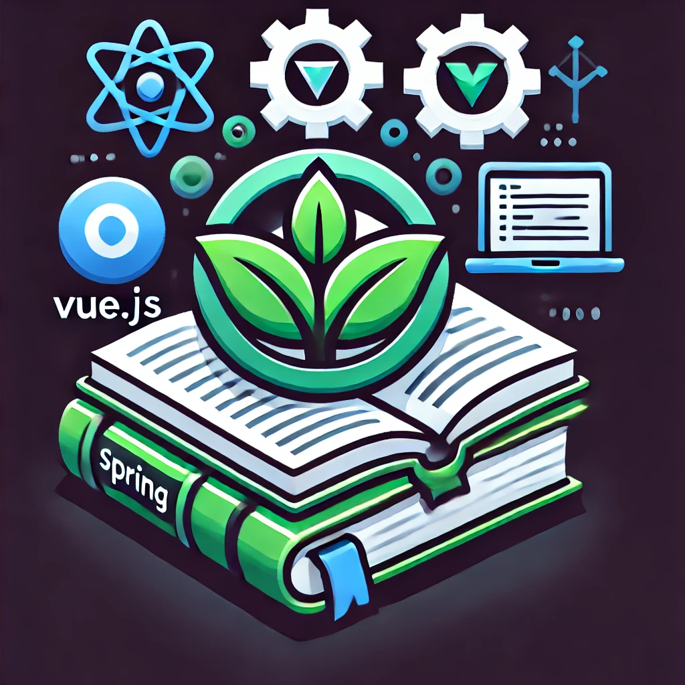

# Spring Java VueJS Book Management Application

[](https://github.com/spring-projects/spring-boot)
[](https://github.com/spring-projects/spring-boot)
[](https://vuejs.org/)


<div style="width: 40%; margin: auto;">
  
</div>

This project consists of a **Spring Boot** backend and a **VueJS** frontend, forming a full-stack blog application. It allows users to create, read, update, and delete blog posts, and also comment on each post.

---

## Table of Contents

- [Project Overview](#project-overview)
- [Technologies Used](#technologies-used)
- [Project Setup](#project-setup)
- [Running the Application](#running-the-application)
- [Configuration](#configuration)
- [Building the Application](#building-the-application)
- [Endpoints](#endpoints)
- [Testing](#testing)
- [Deployment](#deployment)
- [Flyway Migrations](#flyway-migrations)

---

## Project Overview

This Spring Boot application provides the backend API for managing books and comment them, while the VueJS frontend fetches data and displays it to the user.

### Example API Response:
Here’s an example response:

```json
[
  {
    "id": 1,
    "title": "Spring Boot Basics",
    "isbn": "978-1234567890",
    "description": "A comprehensive guide to Spring Boot.",
    "userDTO": {
      "fullName": "Alice Smith"
    },
    "comments": [
      {
        "content": "Excellent book for beginners!",
        "authorFullName": "Alice Smith"
      },
      {
        "content": "Helped me start with Spring Boot.",
        "authorFullName": "Bob Thompson"
      }
    ]
  },
  {
    "id": 2,
    "title": "Advanced Java Programming",
    "isbn": "978-0987654321",
    "description": "Deep dive into advanced Java topics.",
    "userDTO": {
      "fullName": "Bob Thompson"
    },
    "comments": [
      {
        "content": "Very detailed and insightful.",
        "authorFullName": "Bob Thompson"
      },
      {
        "content": "Perfect for experienced developers.",
        "authorFullName": "John Doe"
      },
      {
        "content": "I experienced success thanks to this book!",
        "authorFullName": "Alice Smith"
      }
    ]
  },
  {
    "id": 3,
    "title": "Data structures and Algorithms",
    "isbn": "978-0933614344",
    "description": "Learn Data structures for Java Pro",
    "userDTO": {
      "fullName": "John Doe"
    },
    "comments": [
      {
        "content": "Clear explanations of algorithms.",
        "authorFullName": "John Doe"
      },
      {
        "content": "Great reference for coding interviews.",
        "authorFullName": "Jane Dane"
      }
    ]
  },
  {
    "id": 4,
    "title": "Spring 6 and Boot 3",
    "isbn": "978-0921324370",
    "description": "From beginner to GURU in Spring",
    "userDTO": {
      "fullName": "Jane Dane"
    },
    "comments": [
      {
        "content": "Comprehensive Spring coverage.",
        "authorFullName": "Jane Dane"
      },
      {
        "content": "Loved the practical examples.",
        "authorFullName": "Alice Smith"
      },
      {
        "content": "good book Jabe!",
        "authorFullName": "John Doe"
      },
      {
        "content": "good catch fellas!",
        "authorFullName": "Bob Thompson"
      }
    ]
  }
]
```

## Project Setup

```
spring-blog-vuejs
├── backend            → Backend module with Spring Boot code
│   ├── src            → Source code for Spring Boot backend
│   ├── pom.xml        → Maven configuration for the backend module
│   └── application.yml → Spring Boot application configuration
├── frontend           → Frontend module with Vue.js and Vite
│   ├── src            → Source code for Vue.js frontend
│   │   ├── assets     → Static assets like images, fonts
│   │   ├── components → Vue components
│   │   ├── router     → Router configuration
│   │       └── index.ts → Main router config file
│   │   ├── views      → Vue views or pages
│   │   ├── App.vue    → Main Vue component
│   │   └── main.ts    → Vue.js entry point (Vite)
│   ├── public         → Public folder for static files
│   │   └── index.html → HTML template for the frontend
│   ├── test           → Unit tests and test-related files
│   │   ├── unit       → Component tests (with Vitest)
│   │   └── setup.ts   → Test setup file for Vitest
│   ├── package.json   → Node.js configuration for the frontend (Vue.js, Vite, Vitest)
│   ├── vite.config.ts → Vite configuration for the frontend
│   └── tsconfig.json  → TypeScript configuration for frontend
├── .env               → Environment variables for frontend (Vite)
├── .env.local         → Local environment variables for frontend (Vite)
└── pom.xml            → Parent Maven POM managing both backend and frontend modules
```

1. **Clone Repository**
   ```bash
   git clone https://github.com/daniellaera/spring-vuejs-book-management.git
   cd spring-blog-app
   ```

## Deployment Configuration

1. **Set Up Environment Variables**  
   Configure the following environment variables in your GitHub Actions workflow file (`.yml`), in the deployment service's settings, or in the repository's secrets section:

    - `DATABASE_URL`: The URL for your database connection (e.g., `jdbc:postgresql://<host>:<port>/<dbname>` for PostgreSQL).
    - `DATABASE_USERNAME`: The username for your database.
    - `DATABASE_PASSWORD`: The password for your database.

   ### Example for GitHub Actions
   You can set these environment variables as repository secrets in GitHub, and then reference them in your workflow file:

   ```yaml
   env:
    DATABASE_URL: ${{ secrets.DATABASE_URL }}
    DATABASE_USERNAME: ${{ secrets.DATABASE_USERNAME }}
    DATABASE_PASSWORD: ${{ secrets.DATABASE_PASSWORD }}
    FRONTEND_URL: ${{ secrets.FRONTEND_URL }}

## Technologies Used

- **Java** and **Spring Boot** for backend development
- **PostgreSQL** as the relational database
- **Flyway** for database migrations
- **JUnit** and **Mockito** for unit and integration testing
- **GitHub Actions** for CI/CD pipeline

## Running the Application

1. **Run the application locally** with:
   ```bash
   ./mvnw spring-boot:run
   ```

2. **Run with the dev profile to load configuration from application-dev.yml** with:
   ```bash
   ./mvnw spring-boot:run -Dspring-boot.run.profiles=dev
   ```

3. **Access the application** at `http://localhost:8080`

## Configuration

The application settings are primarily managed through `application.yml` with environment-specific values for:
```yaml
spring:
  datasource:
    url: ${DATABASE_URL}
    username: ${DATABASE_USERNAME}
    password: ${DATABASE_PASSWORD}
    driver-class-name: org.postgresql.Driver
  flyway:
    enabled: true
    locations: classpath:db/migration
  jpa:
    hibernate:
      ddl-auto: none

jwt:
  secret: 357638792F423F4428472B4B6250655368566D597133743677397A2443264629
  expiration: 86400000
  jwtRefreshExpirationMs: 86400000

frontend:
  url: ${FRONTEND_URL}
```

## Building the Application

To build the application and create an executable JAR file:
```bash
./mvnw clean package
```

## Endpoints

### Post Endpoints
- `GET /api/v3/book` - Retrieves all books
- `GET /api/v3/book/{bookId}` - Retrieves a specific book by ID

### Comment Endpoints
- `GET /api/v3/{bookId}/comments` - Retrieves all comments by bookId
- `POST /api/v3/comment/{bookId}` - Create new comment on specific book

## Testing

Run tests with:
```bash
./mvnw test
```
The application includes unit tests for service layers and integration tests for the repository layer, ensuring data consistency and business logic reliability.

## Deployment

The application is configured to deploy using **Fly.io** via GitHub Actions. Ensure that the following GitHub Secrets are set for the deployment pipeline:
- `FLY_API_TOKEN`
- `DATABASE_URL`
- `DATABASE_USERNAME`
- `DATABASE_PASSWORD`
- `FRONTEND_URL`

## Flyway Migrations
This SQL file, located in `src/main/resources/db/migration`, is processed by Flyway on startup if the database is missing this migration. It includes the initial table definitions and some sample data for testing:
`V1__init.sql`
```sql
-- Create the book table with a foreign key constraint on author_id
CREATE TABLE _book
(
    id          INTEGER GENERATED BY DEFAULT AS IDENTITY PRIMARY KEY,
    title       VARCHAR(255) NOT NULL,
    isbn        VARCHAR(17)  NOT NULL,
    description TEXT,
    author_id   INTEGER      NOT NULL,
    CONSTRAINT fk_author FOREIGN KEY (author_id) REFERENCES _user (id)
);

-- Insert initial book data, ensuring author_id corresponds to existing users
INSERT INTO _book (title, isbn, description, author_id)
VALUES ('Spring Boot Basics', '978-1234567890', 'A comprehensive guide to Spring Boot.', 1),
       ('Advanced Java Programming', '978-0987654321', 'Deep dive into advanced Java topics.', 2),
       ('Data structures and Algorithms', '978-0933614344', 'Learn Data structures for Java Pro', 3),
       ('Spring 6 and Boot 3', '978-0921324370', 'From beginner to GURU in Spring', 4);
```

> *Tip: For safe versioning, avoid modifying applied migration files like `V1__init.sql`. Instead, create new migration files (e.g., `V2__add_column.sql`) for schema updates.*