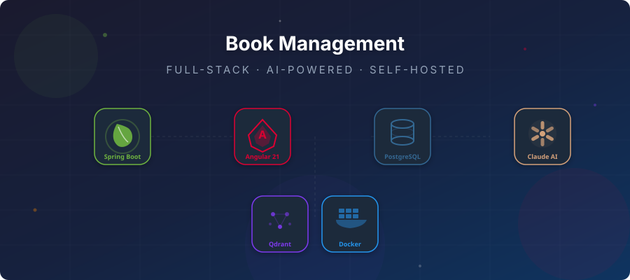

# Spring Boot & Angular Book Management Application

[](https://github.com/spring-projects/spring-boot)
[](https://github.com/spring-projects/spring-boot)
[](https://angular.dev/)


<div style="width: 100%; margin: auto;">
  
</div>

A full-stack book management application with an **AI-powered chat assistant**. Users can browse, create, rate, and comment on books, and interact with an intelligent library assistant that uses **semantic search** and **Claude AI** to answer questions about the book catalog.

**Live Demo:** [https://bookmanagement.daniellaera.com](https://bookmanagement.daniellaera.com)

---

## Architecture Overview

```
┌──────────────────┐     ┌──────────────────┐     ┌──────────────────┐
│   Angular 21     │────▶│  Spring Boot 4   │────▶│   PostgreSQL     │
│   (Frontend)     │     │  (Backend API)   │     │   (Database)     │
└──────────────────┘     └────────┬─────────┘     └──────────────────┘
                                  │
                    ┌─────────────┼─────────────┐
                    ▼             ▼              ▼
             ┌───────────┐ ┌───────────┐ ┌───────────────┐
             │  Claude   │ │  Qdrant   │ │    Ollama     │
             │  (Haiku)  │ │ (Vectors) │ │ (Embeddings)  │
             └───────────┘ └───────────┘ └───────────────┘

┌──────────────────┐
│    n8n           │──── Nightly: Fetch books → Generate embeddings → Store in Qdrant
│ (Workflow Engine)│
└──────────────────┘
```

## Key Features

- **Book Management** — CRUD operations with pagination, sorting, and search
- **User Authentication** — JWT-based auth with GitHub OAuth2 login
- **Ratings & Comments** — Users can rate and comment on books
- **Book Borrowing** — Track book availability and borrowing history
- **AI Chat Assistant** — Conversational library assistant powered by Claude Haiku
- **Semantic Search** — Vector-based book search using Qdrant and Ollama embeddings
- **Nightly Enrichment** — n8n workflow generates book embeddings on a schedule
- **Cost Protection** — Rate limiting (per user/day), response caching, and feature toggles
- **Dark Mode** — Toggle between light and dark themes
- **Swagger UI** — Interactive API documentation at `/swagger-ui.html`

## Technologies

### Backend
- **Spring Boot 4.0.2** with Java 21
- **Spring Security** — JWT + OAuth2 (GitHub)
- **Spring Data JPA** — PostgreSQL with Flyway migrations
- **Spring AI** — Anthropic Claude integration (Haiku model)
- **WebFlux** — SSE streaming for real-time AI responses
- **SpringDoc OpenAPI 3** — Swagger UI
- **Quartz** — Scheduled tasks

### Frontend
- **Angular 21** with TypeScript
- **PrimeNG** — UI component library
- **Signals** — Reactive state management
- **SSE Streaming** — Real-time chat responses

### AI & Search
- **Claude Haiku** — Fast, low-cost LLM for natural language answers
- **Qdrant** — Vector database for semantic book search
- **Ollama** — Local embedding generation (nomic-embed-text model)
- **n8n** — Workflow automation for nightly embedding pipeline

### Infrastructure
- **Docker** — Containerized deployment
- **Nginx Proxy Manager** — HTTPS reverse proxy
- **Gitea Actions** — CI/CD pipeline
- **Nexus** — Docker registry and Maven repository
- **Proxmox** — Self-hosted virtualization

---

## Project Structure

```
spring-book-management
├── backend/                → Spring Boot API
│   ├── src/main/java/
│   │   ├── config/         → Security, CORS, OpenAPI configs
│   │   ├── controller/     → REST controllers (Book, Auth, AI, etc.)
│   │   ├── model/          → JPA entities
│   │   ├── dao/            → DTOs
│   │   ├── repository/     → Spring Data repositories
│   │   ├── service/        → Business logic, AI services
│   │   └── properties/     → Configuration properties
│   ├── src/main/resources/
│   │   ├── db/migration/   → Flyway SQL migrations
│   │   ├── application.yml → Production config (env vars)
│   │   └── application-dev.yml → Local dev config
│   ├── docker-compose.db.yml
│   └── pom.xml
├── frontend/               → Angular 21 SPA
│   ├── src/app/
│   │   ├── components/     → UI components (chat-widget, navbar, etc.)
│   │   ├── services/       → HTTP services (book, auth, chat-ai)
│   │   ├── models/         → TypeScript interfaces
│   │   └── guards/         → Route guards
│   ├── angular.json
│   └── package.json
└── compose.yml             → Docker Compose (dev)
```

---

## Getting Started

### Prerequisites

- Java 21
- Node.js 24+
- Docker & Docker Compose
- Ollama (for local AI features)

### Local Development

**1. Start infrastructure:**

```bash
cd backend
docker compose -f ./docker-compose.db.yml up   # PostgreSQL + Qdrant
```

**2. Pull the embedding model:**

```bash
ollama pull nomic-embed-text
```

**3. Start the backend:**

```bash
cd backend
./mvnw spring-boot:run -Dspring-boot.run.profiles=dev
```

**4. Start the frontend:**

```bash
cd frontend
npm install
ng serve
```

**5. Access the application** at `http://localhost:4200`

### Environment Variables

The backend requires these environment variables (or use `application-dev.yml` for local dev):

| Variable | Description |
|----------|-------------|
| `DATABASE_URL` | PostgreSQL JDBC URL |
| `DATABASE_USERNAME` | Database username |
| `DATABASE_PASSWORD` | Database password |
| `JWT_SECRET` | JWT signing secret |
| `FRONTEND_URL` | Frontend URL for CORS |
| `GITHUB_CLIENT_ID` | GitHub OAuth client ID |
| `GITHUB_SECRET` | GitHub OAuth secret |
| `GITHUB_REDIRECT_URI` | GitHub OAuth redirect URI |
| `ANTHROPIC_API_KEY` | Anthropic API key for Claude |
| `QDRANT_URL` | Qdrant vector DB URL |
| `OLLAMA_URL` | Ollama API URL |

---

## AI Chat Assistant

The AI chat assistant uses a **RAG (Retrieval-Augmented Generation)** pattern:

1. **User asks a question** in the chat widget
2. **Ollama** generates an embedding for the question (free, local)
3. **Qdrant** finds the most relevant books via vector similarity search (free)
4. **Claude Haiku** receives only the relevant books and generates a natural language answer (low cost)
5. **Cache** stores responses — identical questions are served instantly at zero cost

### Cost Protection

- **Rate Limiting** — Configurable daily request limit per user
- **Response Caching** — 1-hour cache for identical queries
- **Feature Toggle** — AI can be enabled/disabled via config
- **Minimal Context** — Only relevant books sent to Claude (not entire catalog)

### Nightly Embedding Pipeline

An **n8n workflow** runs nightly to keep the vector database in sync:

```
Schedule (midnight) → Fetch books from API → Generate embeddings via Ollama → Store in Qdrant
```

---

## API Endpoints

### Authentication
| Method | Endpoint | Auth | Description |
|--------|----------|------|-------------|
| POST | `/api/v3/auth/signup` | Public | Register new user |
| POST | `/api/v3/auth/signin` | Public | Login, returns JWT |
| GET | `/api/v3/auth/me` | USER | Get current user details |

### Books
| Method | Endpoint | Auth | Description |
|--------|----------|------|-------------|
| GET | `/api/v3/book` | Public | List books (paginated) |
| GET | `/api/v3/book/{id}` | Public | Get book by ID |
| POST | `/api/v3/book` | USER | Create book |
| PUT | `/api/v3/book/{id}` | USER | Update book |
| DELETE | `/api/v3/book/{id}` | USER | Delete book |

### AI Assistant
| Method | Endpoint | Auth | Description |
|--------|----------|------|-------------|
| GET | `/api/v3/ai/books/ask/stream` | Public | Stream AI response (SSE) |
| POST | `/api/v3/ai/books/ask` | USER | Get AI response |
| POST | `/api/v3/ai/books/search` | Public | Semantic book search |
| POST | `/api/v3/ai/books/index` | Public | Trigger book indexing |
| GET | `/api/v3/ai/books/remaining` | USER | Check remaining daily requests |

### Swagger UI

Interactive API documentation is available at:
- **Local:** `http://localhost:8080/swagger-ui/index.html`
- **Production:** `https://bookmanagement.daniellaera.com/swagger-ui/index.html`

To use protected endpoints in Swagger:
1. Call `POST /api/v3/auth/signin` with `{ "email": "...", "password": "..." }`
2. Copy the `token` from the response
3. Click the **Authorize** 🔓 button at the top of Swagger UI
4. Enter the token and click **Authorize**
5. All subsequent requests will include the JWT automatically

---

## Deployment

### Production Stack (Docker Compose)

```yaml
services:
  backend:
    image: docker.nexus.daniellaera.com/book-backend:latest
    env_file: ./backend.env
    ports: ["8080:8080"]
  frontend:
    image: docker.nexus.daniellaera.com/book-frontend:latest
    ports: ["80:80"]
  qdrant:
    image: qdrant/qdrant
    ports: ["6333:6333"]
    volumes: [qdrant-data:/qdrant/storage]
```

### CI/CD Pipeline (Gitea Actions)

On push to `main`:
1. Detect changed files (backend/frontend)
2. Build and test changed modules
3. Build Docker images and push to Nexus registry
4. SSH to server → pull images → `docker compose down && up -d`

---

## Testing

```bash
# Backend tests (with Testcontainers)
cd backend && ./mvnw test

# Frontend tests
cd frontend && npm run test -- --watch=false
```

---

## Database Migrations

Flyway manages schema versioning. Never modify applied migrations — create new ones:

```
backend/src/main/resources/db/migration/
├── V1__init.sql
├── V2__add_column.sql
└── V3__add_ratings.sql
```

---

## License

This project is for educational and portfolio purposes.